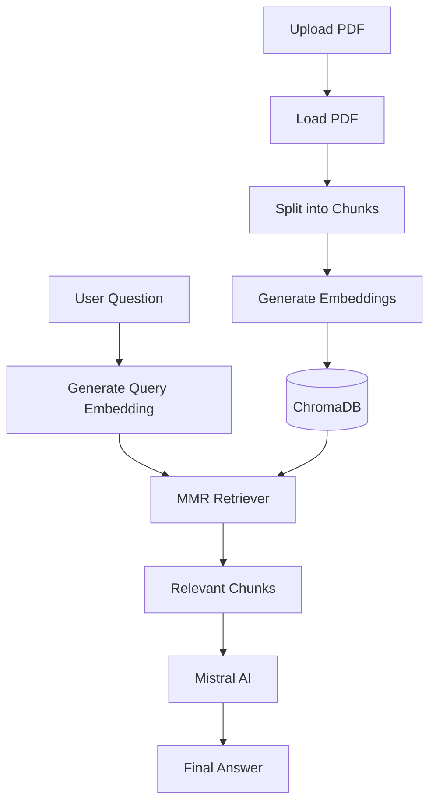

<div align="center">

# 📚 CourseMateAI

### Retrieval-Augmented Generation for Intelligent Document Conversations

<p>
An open-source RAG application that lets you upload a PDF and chat with it —<br/>
grounded, context-aware answers powered by LangChain, ChromaDB, HuggingFace & Mistral AI.
</p>

<br/>


<p>
  <a href="#-installation">Installation</a> •
  <a href="#-how-it-works">How It Works</a> •
  <a href="#%EF%B8%8F-tech-stack">Tech Stack</a> •
  <a href="#-roadmap">Roadmap</a> •
  <a href="#-contributing">Contributing</a>
</p>

</div>

---

## 🌟 Overview

**CourseMateAI** answers questions directly from your own PDF documents.

Instead of relying solely on an LLM's internal (and often outdated) knowledge, the app retrieves the most relevant passages from your document, feeds them to the model as context, and generates a response grounded in *your* content — cutting down on hallucinations and improving factual accuracy.

The current release, **v1.0.0**, delivers a complete, minimal end-to-end RAG pipeline: ingestion → chunking → embedding → vector search → grounded generation, wrapped in a simple Streamlit UI.

---

## ✨ Features

| | |
|---|---|
| 📄 **PDF Upload** | Drop in any PDF and index it in seconds |
| ✂️ **Recursive Chunking** | Configurable chunk size & overlap for clean splits |
| 🧠 **Semantic Embeddings** | HuggingFace `BAAI/bge-small-en-v1.5` |
| 🗄️ **Persistent Vector Store** | ChromaDB, stored locally on disk |
| 🎯 **MMR Retrieval** | Maximum Marginal Relevance for relevant, non-redundant chunks |
| 🤖 **Mistral AI Generation** | Fast, high-quality grounded answers |
| 🔍 **Chunk Inspector** | View exactly which chunks were retrieved for an answer |
| 💬 **Streamlit UI** | Clean, interactive chat interface |

---

## 🏗️ Architecture

```text
                              Upload PDF
                                  │
                                  ▼
                            PyPDFLoader
                                  │
                                  ▼
                RecursiveCharacterTextSplitter
                                  │
                                  ▼
                          Document Chunks
                                  │
                                  ▼
                  HuggingFace Embeddings (BGE)
                                  │
                                  ▼
                       Chroma Vector Database
                                  │
   ═══════════════════════════════╪═══════════════════════════════
                                  │
                            User Question
                                  │
                                  ▼
                          Query Embedding
                                  │
                                  ▼
                        MMR Vector Retriever  ◄──────────┘
                                  │
                                  ▼
                      Relevant Document Chunks
                                  │
                                  ▼
                        Prompt Construction
                                  │
                                  ▼
                           Mistral AI LLM
                                  │
                                  ▼
                          Contextual Answer
```

<details>
<summary><b>View as Mermaid flowchart</b></summary>



</details>

---

## ⚙️ Tech Stack

| Component | Technology |
|---|---|
| Language | Python 3.11+ |
| Framework | LangChain |
| LLM | Mistral AI |
| Embedding Model | HuggingFace `BAAI/bge-small-en-v1.5` |
| Vector Database | ChromaDB |
| Document Loader | PyPDFLoader |
| Text Splitter | RecursiveCharacterTextSplitter |
| Frontend | Streamlit |
| Environment | python-dotenv |

---

## 📂 Project Structure

```text
CourseMateAI/
│
├── app.py                   # Streamlit UI
├── main.py                  # RAG inference pipeline (retrieval + generation)
├── create_database.py       # Document indexing pipeline (load → split → embed → store)
├── requirements.txt
├── .env.example
├── .gitignore
├── LICENSE
├── README.md
│
├── chroma_db/                # Persistent Chroma vector database
├── document_loaders/          # Source PDFs
└── screenshots/
```

---

## 🚀 Installation

```bash
# 1. Clone the repository
git clone https://github.com/<your-username>/CourseMateAI.git
cd CourseMateAI

# 2. Install dependencies
pip install -r requirements.txt
```

### Environment Variables

Create a `.env` file in the project root:

```env
# Required
MISTRAL_API_KEY=your_mistral_api_key

# Optional (recommended — faster downloads & higher rate limits)
HUGGINGFACEHUB_API_TOKEN=your_huggingface_token
```

### Run

```bash
streamlit run app.py
```

Then:
1. Upload a PDF
2. Click **Create Database**
3. Wait for indexing to finish
4. Start asking questions

---

## 🧠 How It Works

CourseMateAI runs a **two-stage** RAG workflow, deliberately split into two scripts.

### Stage 1 — Indexing (`create_database.py`)

Runs once per document (or whenever it changes):

```
PDF → Load → Split into Chunks → Generate Embeddings → Store in ChromaDB
```

### Stage 2 — Question Answering (`main.py`)

Runs on every user query, without touching the raw PDF again:

```
Question → Query Embedding → Search ChromaDB → Retrieve Chunks → Build Prompt → Mistral AI → Answer
```

**Why split them?** Indexing (loading, chunking, embedding) is expensive and should happen exactly once. If it lived inside the query path, every question would re-embed the entire document — slow and wasteful. Separating indexing from inference mirrors how production RAG systems are designed.

### Retrieval Strategy

The current version uses **Maximum Marginal Relevance (MMR)**, which balances semantic similarity with result diversity to avoid redundant chunks:

```python
retriever = vector_store.as_retriever(
    search_type="mmr",
    search_kwargs={
        "k": 4,
        "fetch_k": 10,
        "lambda_mult": 0.5
    }
)
```

---

## 📸 Screenshots

| Home | Upload PDF |
|---|---|
| *Add screenshot* | *Add screenshot* |

| Chat Interface | Retrieved Chunks |
|---|---|
| *Add screenshot* | *Add screenshot* |

---

## 🗺️ Roadmap

- [x] **v1.0.0** — Single PDF support, recursive chunking, ChromaDB, MMR retrieval, Mistral AI, Streamlit UI
- [ ] **v1.1.0** — Multi-PDF support, dynamic document selection, improved file management
- [ ] **v1.2.0** — Persistent chat history, conversation memory, better session management
- [ ] **v1.3.0** — MultiQuery retriever, Parent Document retriever, retrieval quality improvements
- [ ] **v2.0.0** — Hybrid search (BM25 + vector), cross-encoder reranking, query rewriting, source citations, streaming responses, authentication, production-ready architecture

<details>
<summary><b>Longer-term architectural goals</b></summary>

**Architecture**
- Configuration management (`config.py`)
- Reusable retriever module & prompt management (`prompts.py`)
- Dedicated RAG chains using LCEL

**Retrieval**
- Contextual compression, hybrid search, query rewriting, cross-encoder reranking

**Engineering**
- Logging, structured error handling, modular components

**Product**
- Multi-document support, agentic RAG, evaluation dashboard, source attribution

</details>

---

## 🎯 Learning Outcomes

Building this project deepened practical understanding of:

Document loaders · Recursive chunking · Embedding models · Vector databases · Semantic search · Retrieval strategies (MMR) · Prompt engineering · LangChain · ChromaDB · Mistral AI

---

## 🤝 Contributing

Contributions, issues, and feature requests are welcome!

1. Fork the repository
2. Create a feature branch
3. Commit your changes
4. Open a Pull Request

Please include clear documentation for any new feature and follow the existing project structure.

---

## 📄 License

Licensed under the **MIT License** — see [`LICENSE`](LICENSE) for details.

---

## 🙏 Acknowledgements

Built on the excellent open-source ecosystem provided by **LangChain**, **ChromaDB**, **Hugging Face**, **Mistral AI**, and **Streamlit**.

---

## ✍️ Author

**Kanishk Gupta**
Computer Science Engineering undergraduate with a strong interest in Generative AI, LLMs, RAG, AI Engineering, and Full-Stack Development.

[GitHub](https://github.com/your-username) · [LinkedIn](https://linkedin.com/in/your-profile)

---

<div align="center">

### ⭐ If you found this project useful, consider giving it a star — it helps others discover it!

Made with ❤️ using LangChain • ChromaDB • HuggingFace • Mistral AI • Streamlit

</div>
